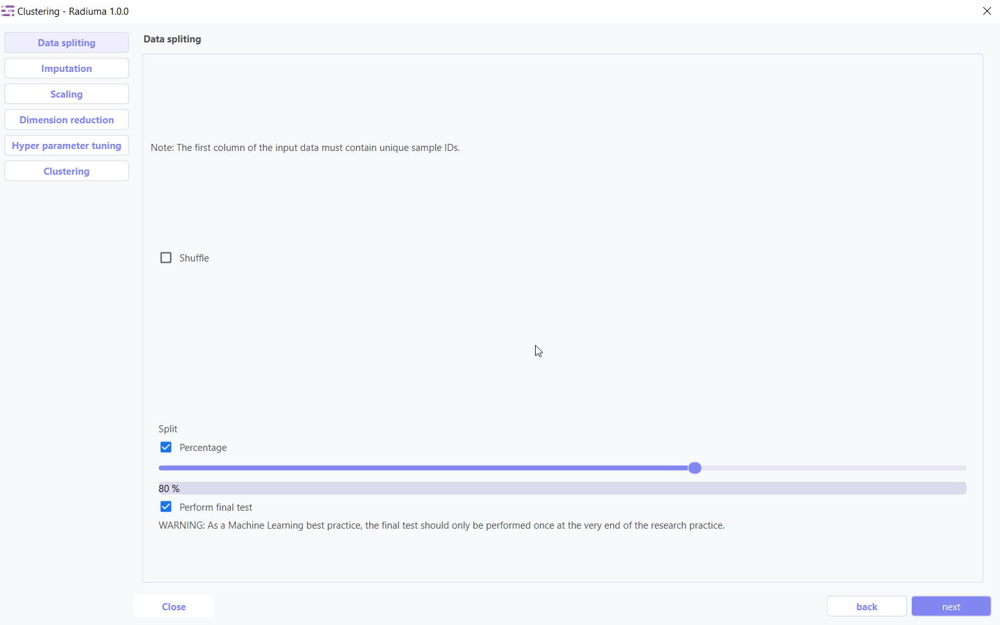
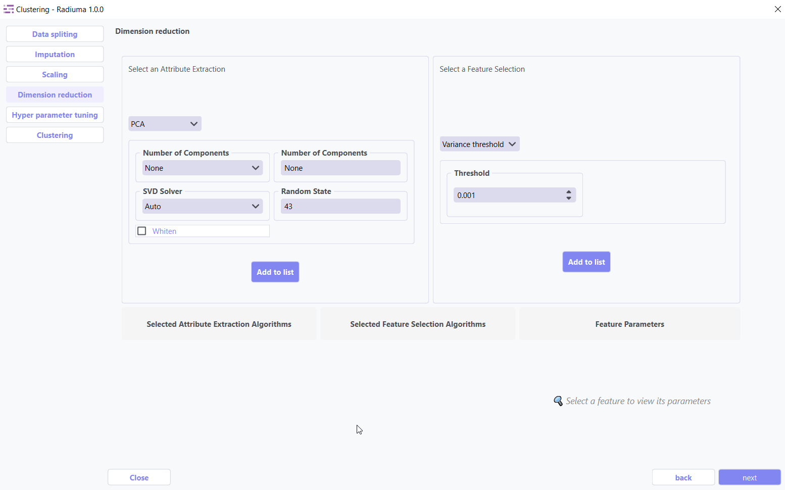
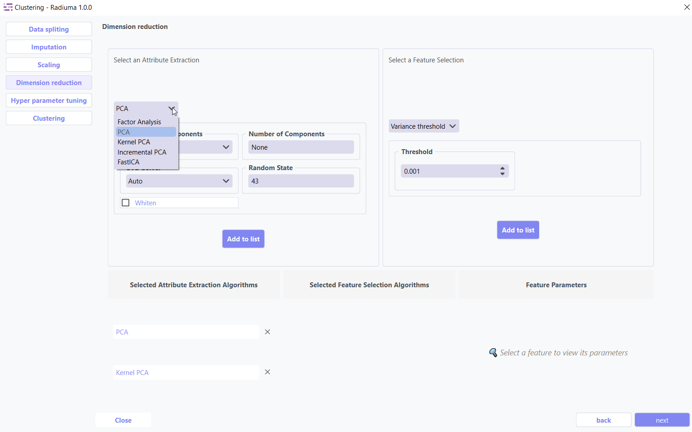
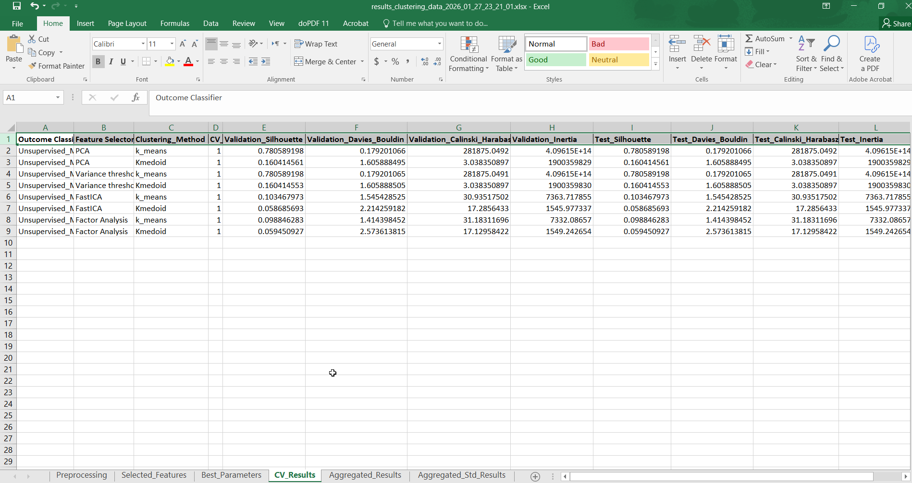

Clustering
----------

Overview
^^^^^^^^

The **Clustering module** provides a streamlined, step-by-step workflow within the application for discovering natural groupings and patterns in medical data without predefined labels. Starting with structured data import, the interface automatically validates your feature table format before proceeding to analysis. Through an organized sequence of configurable panels, you can systematically handle missing values using advanced imputation techniques, normalize features with multiple scaling options, and optimize your dataset through dimension reduction methods tailored for unsupervised learning. The module then presents a comprehensive selection of clustering algorithms with customizable parameters, enabling you to explore different grouping strategies and compare cluster quality metrics. The system culminates with detailed evaluation scores and visualization capabilities, providing you with the tools to identify meaningful patient subtypes, disease patterns, or biomarker clusters—all within a unified, user-friendly environment designed for both data scientists and clinical researchers exploring unsupervised learning applications.

The clustering tool provides a complete unsupervised learning pipeline with:

* 5 clustering algorithms
* Automated data preprocessing
* Hyperparameter optimization
* Comprehensive model evaluation

Data Import
^^^^^^^^^^^

Before splitting or processing your data, ensure it is **properly structured**.

**Important Note :** 

* **Data Requirement**: The first column of the input data data must contain unique sample IDs.

.. image:: images/16.clustering_data.png    
   :alt: Clustering
   :width: 100%

Data Splitting
^^^^^^^^^^^^^^

**Data Splitting Options:**

* **Shuffle**: Enable shuffling to randomize the data before splitting
* **Split**: Choose between percentage split or K-fold cross-validation
* **Percentage**: Specify training data percentage (e.g., 80%)
* **Perform Final Test**: Option to reserve data for final testing

Imputation
^^^^^^^^^^

.. image:: images/16.clustering_imputation.png
   :alt: clustering Imputation
   :width: 100%

The imputation step addresses missing values in your dataset by replacing them with calculated values using three advanced strategies: **Simple Imputer, KNN Imputer, and Iterative Imputer**. Options include mean, median, or mode imputation for categorical data, ensuring your classification models have complete datasets for accurate predictions.

1. **Simple Imputer:** Basic replacement strategies for quick handling of missing data.

**Imputation Options:**

* **Continuous Missing Value**: Strategy for handling missing numerical values
* **Categorical Missing Value**: Strategy for handling missing categorical values

**Imputation Strategy:**

* **Mean**: Replace with feature mean
* **Median**: Replace with feature median
* **Most Frequent**: Replace with most common value
* **Constant**: Replace with user-specified value

2. **KNN Imputer:** Nearest-neighbor based imputation using feature similarity.

* **Key Parameters**:
   
* **n_neighbors** (default: 5) – Number of neighbors used to impute missing values
* **metric** – Distance function non-euclidean, 
* **weights** – uniform or distance (distance gives more weight to closer neighbors)

3. **Iterative Imputer:** Advanced method that models each feature with missing values as a function of other features.

* **Key Parameters**:

* **Estimator**  
  Algorithm used to predict missing values for each feature.  

  Common options include:

  - **BayesianRidge** *(default)* – Performs regularized linear regression using Bayesian principles  
  - **GaussianProcessRegressor** – Models non-linear relationships with probabilistic output  
  - **KernelRidge** – Combines ridge regression with kernel tricks for non-linear features  
  - **KNeighborsRegressor** – Uses neighboring samples to estimate missing values  
  - **LinearRegression** – Basic linear approach for imputation  
  - **Lasso / Ridge / ElasticNet** – Regularized linear models for better generalization

* **Imputation Order**  
  Determines the sequence in which features are imputed:

  - **Ascending** *(default)* – Start from features with fewest missing values  
  - **Descending** – Start from features with most missing values  
  - **Random** – Random order for each iteration  
  - **Roman** – Left-to-right (fixed order)

Scaling
^^^^^^^

.. image:: images/16.clustering_scaling.png
   :alt: Clustering Scaling
   :width: 100%

Dimention Reduction
^^^^^^^^^^^^^^^^^

Dimension reduction techniques optimize your dataset by identifying and retaining only the most valuable features. These methods serve two primary purposes:

1. **Attribute Extraction**: Transforms features into a more compact representation while preserving essential patterns
2. **Feature Selection**: Identifies and keeps only the most informative original features

Key Benefits:

   * Reduces computational requirements and training time
   * Improves model performance by eliminating noise
   * Helps prevent overfitting
   * Enhances interpretability of results

* **1. Attribute Extraction Algorithms**

Transform features into a lower-dimensional space while retaining patterns:

* **Available Methods**:

   * **PCA (Principal Component Analysis)**: Linear dimensionality reduction via orthogonal transformation
   * **Kernel PCA**: Non-linear extension of PCA using kernel functions
   * **Factor Analysis**: Models observed variables as linear combinations of latent factors
   * **FastICA**: Independent Component Analysis for signal separation
   * **Incremental PCA**: Efficient PCA for large, streaming datasets

* **2. Feature Selection Algorithm**

Select the most relevant features without transformation:

.. image:: images/16.clustering_featureselection.png
   :alt: Clustering 
   :width: 100%

* **Available Methods**:

   * **Variance Threshold**: Remove low-variance features (user-defined threshold)

Hyperparameter Tuning
^^^^^^^^^^^^^^^^^^^^

.. image:: images/16.clustering_hyperparameter_tuning.png
   :alt: Clustering Hyperparameter Tuning
   :width: 100%

Hyperparameter tuning optimizes algorithm-specific parameters like number of clusters, convergence thresholds, or distance metrics. This systematic search identifies the configuration that produces the most coherent and well-separated clusters for your specific dataset.

clustering Selection
^^^^^^^^^^^^^^^^^^^

.. image:: images/16.clustering_alg.png
   :alt: Clustering Alg
   :width: 100%

The algorithm selection interface allows you to choose from various clustering approaches based on your data characteristics and analytical goals. Each algorithm offers different strengths for discovering patterns in data with distinct distribution shapes, densities, and feature types.

Supported Algorithms
^^^^^^^^^^^^^^^^^^^^

**1. K-Means Clustering**

Partitions observations into k clusters with nearest mean.

**Key Parameters:**

* **Number of Clusters**: Number of clusters to form (default: 8)

.. image:: images/16.clustering_knn.png
   :alt: Clustering Alg
   :width: 100%

* **Initialization Method**: Method for initialization (k-means++, random)
* **Number of Initializations**: Number of times to run with different initializations (default: 10)
* **Max Iterations**: Maximum iterations for a single run (default: 300)
* **Random State**: Seed for reproducible results (default: 42)

**2. Agglomerative Clustering**

Hierarchical approach building nested clusters.

**Key Parameters:**

* **Number of Clusters**: Number of clusters to find (default: 2)
* **Linkage**: Method for calculating distances between clusters (ward, complete, average, single)

.. image:: images/16.clustering-Agglomerative.png
   :alt: Clustering Alg
   :width: 100%

* **Distance Metric**: Metric for calculating distances (euclidean, manhattan, etc.)
* **Compute Distances**: Whether to compute distances for visualization (default: False)

**3. K-Mode Clustering**

Specialized for categorical data.

**Key Parameters:**

* **Number of Clusters**: Number of clusters to form (default: 8)

.. image:: images/16.clustering-k-mode.png
   :alt: Clustering Alg
   :width: 100%

* **Initialization Method**: Method for initial centroids (cao, random, Huang)
* **Number of Initializations**: Number of times to run with different initializations (default: 10)
* **Max Iterations**: Maximum iterations for a single run (default: 100)
* **Random State**: Seed for reproducible results (default: 42)

**4. Gaussian Mixture Model**

Probabilistic model assuming data from Gaussian distributions mixture.

**Key Parameters:**

* **Number of Components**: Number of mixture components (default: 1)

.. image:: images/16.clustering-Gaussian-covarience.png
   :alt: Clustering Alg
   :width: 100%

* **Covariance Type**: Type of covariance parameters (full, tied, diag, spherical)
* **Number of Initializations**: Number of times to run with different initializations (default: 1)
* **Max Iterations**: Maximum number of EM iterations (default: 100)

.. image:: images/16.clustering-Gaussian.png
   :alt: Clustering Alg
   :width: 100%

* **Initialization Parameters**: Method for initialization (kmeans, kmeans++, random, random_from_data)
* **Tolerance**: Convergence threshold (default: 0.01)
* **Random State**: Seed for reproducible results (default: 42)

**5. K-Medoids Clustering**

Partitions observations into k clusters using actual data points as cluster centers (medoids), making it more robust to outliers than K-Means.

**Key Parameters:**

* **Number of Clusters**: Number of clusters to form (default: 8)

.. image:: images/16.clustering-k-medoids_initialization.png
   :alt: Clustering Alg
   :width: 100%

* **Initialization Method**: Method for initial centroids. ( random, first, build )
* **Number of Initializations**: Number of times to run with different initializations (default: 10)

.. image:: images/16.clustering-k-medoids_method.png
   :alt: Clustering Alg
   :width: 100%

* **Method**: Algorithm variant (alternate , pam)

.. image:: images/16.clustering-k-medoids_metric.png
   :alt: Clustering Alg
   :width: 100%

* **Metric**: Distance Metrics (eclidian, cosine, manhattan, percomputed)
* **Max Iterations**: Maximum iterations for a single run (default: 100)
* **Random State**: Seed for reproducible results (default: 42)

Clustering Evaluation Metrics
^^^^^^^^^^^^^^^^^^^^^^^^^^^^^

After training, Radiuma automatically computes standard clustering metrics:

* **Silhouette Score**: Measure of how similar objects are to their own cluster compared to other clusters
* **Davies-Bouldin Index**: Average similarity of each cluster with its most similar cluster
* **Calinski-Harabasz Index**: Ratio of between-cluster dispersion to within-cluster dispersion
* **Inertia**: Sum of squared distances of samples to their closest cluster center

Clustering Workflow
^^^^^^^^^^^^^^^^^^^

.. image:: images/16.clustering_workflow.png
   :alt: Clustering 
   :width: 80%

**Quick Workflow Summary:**

- **Example Workflow**: `Download the Clustering workflow <https://github.com/MohammadRSalmanpour/RADIUMA-DOUCUMENTATION/blob/main/Examples/Workflows/Clustering.radiuma>`_

1. Import and prepare data
2. Handle missing values
3. Scale and optionally reduce dimensions
4. Select clustering algorithm
5. Tune hyperparameters
6. Evaluate clusters

Clustering Output
^^^^^^^^^^^^^^^^^

The Clustering module provides comprehensive output including cluster assignments, visualization plots, performance metrics, and detailed evaluation results to help you identify natural groupings and patterns in your data.

Clustering Pipeline
^^^^^^^^^^^^^^^^^^^

The Clustering tool guides you through a complete workflow:

**1. Data Preprocessing**

* **Feature Scaling**: Standardize features to equal scale
* **Dimensionality Reduction**: Apply PCA or t-SNE before clustering
* **Categorical Encoding**: Convert categorical variables for distance-based algorithms

**2. Model Selection**

* **Algorithm Selection**: Choose appropriate clustering method based on data type
* **Parameter Tuning**: Optimize key parameters like number of clusters
* **Initialization Method**: Choose how to initialize cluster centers

**3. Cluster Evaluation**

* **Visualization**: Plot clusters in 2D/3D space
* **Validation**: Assess cluster quality using internal and stability metrics
* **Interpretation**: Analyze cluster characteristics and distributions
